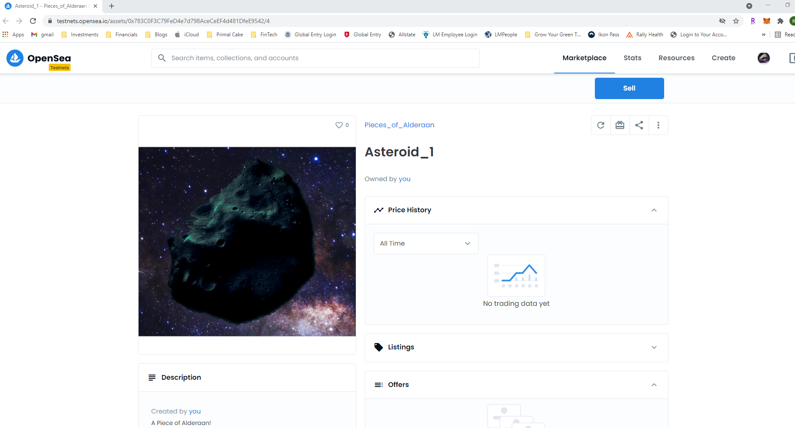

# Pieces of Alderaan

## Project Team
Sarah Rupprecht

Kelsey Heimmer

Tyler Murray

Dan Godzich

## Explosion of the NFT Market

The first Cryptocurrency, Bitcoin debuted in 2009. It was the introduction of blockchain technology to the general public. 

In the next decade, most interest in blockchain centered around new cryptocurrencies or coins. These are all what are known as fungible tokens.

With the advent of Ethereum in 2014, the concept of smart contracts on a blockchain was introduced. Crypto currencies, or coins, and smart contracts were the dominent drivers of blockchain technology.

In 2016 memes began to gain traction on the blockchain as Non-fungible Tokens or NFTs. Rare Pepes, unique images of a cartoon frog showed that original artwork could be popularly traded on the
blockchain. 

In 2017, Cryptopunks began to generate a limited number of unique artwork tokens onto the blockchain.

Then came Cryptokitties that used the Ethereum ERC721 contract standard for generating NFTs. They went viral. 

Over the next three years the NFT market slowly grew until 2021 when NFTs exploded onto the public's consciousness. Soon such items as "digital baseball cards" and other digital art began to be traded at high volume and at times, high prices.

[Opensea](https://opensea.io/) is the largest platform to market NFTs. With a market valuation of over $1.5 billion as a start up-it is cosidered a unicorn. Among OpenSea's top investors is [Mark Cuban](https://en.wikipedia.org/wiki/Mark_Cuban) a Dallas based entrepenuer know as one of the "sharks" on the Shark Tank TV program.

While there are ways to create or "mint" an NFT on OpenSea or other similar platforms we wanted to create our own NFT from code. 

Since marketability for NFTs is key, we decided to target a popular sub culture with a history of enjoying collectibles. 

That is why we based our NFTs on the fictional planet of Alderaan from a science fiction film series. In the series, Alderaan is destroyed by a giant space laser.

Much as people now collect pieces of the fallen Berlin Wall, as a historical artifact, we thought it would be entertaining to collect pieces of the destroyed planet - which would now be planetoids circling in space.

## Local Host Version on Remix

First, we generated solidity contracts using ReMix. In these contracts we created an auction contract and a minting contract. Both were based on the ERC721 protocol. We compiled and deployed these two contracts. We created a frontend using json files. 

While this seemed to work, it was only able to be deployed on a local host and not into the actual Ethereum blockchain. We wanted to mint Alderaan planetoids that would appear on OpenSea. 

## Designing Our Planetoids

We created a limited series of images and uploaded them to the Interplanetary Filing System (IPFS), using the [Infura](https://infura.io/?utm_source=blog&utm_medium=Tutorial:%20Getting%20Started&utm_campaign=Tutorials) Ethereum API . 

We wanted them to look like floating pieces of a destroyed planet.

## Using Brownie with Solidity and Python

Then, we wrote a solidity contract, and two python scripts that would be used to deploy and generate the NFTs to OpenSea testnet. We decided to use the testnet to avoid the high cost of actual Ethereum. We used Rinkeby test net eth.

We wrote the three contracts using Visual Studio (VS) since it allows for both solidity and python. We had to upload several extensions into VS to allow us to write in Solidity, the language of Ethereum contracts. The Solidity code was a contract based on the ERC721 protocol. The first python script was designed to compile and deploy the smart contract, and the second was to have the contract mint the NFT to OpenSea. 

Then we had to load a software called Brownie, which allows solidity files to interact with python files. They would all be launched through brownie commands in a terminal.

At first we were very frustrated as we had great trouble getting Brownie to make the solidity contract deploy using the python script. There is not much help online for using Brownie as the whole NFT field is fairly recent.

Eventually we realized that Brownie needs to be first intitilized, which creates folders and a file tree, that brownie uses to interface solidity with python. After we initialized Brownie, we then had to make sure our contract solidity files and our python scripts were in the correct folders to run Brownie commands. 

Our code was still not running properly, until we realized that to run the _setTokenURI command in our contract, we had to change the protocol to ERC721StorageURI. Apparently the _setTokenURI command had been phased out of the newest version of the ERC721 protociol.

## Final Steps

Once this was debugged, along with a few other corrections we were able to mint to the OpenSea testnet. But to our disappointment the images were not appearing. Finally, we realized we needed to point to the correct IPFS url to capture the image. Our Piece of Alderaan collectible, was finally minted onto the testnet for all to see. 

[Our Panetoid on the testnet](https://files.slack.com/files-pri/T01S3KQNZDK-F02GJV38TDE/image.png)

## Conclusion

We started to write randomization code into our smart contract and python scripts to genrerate new and unique planetoids. But the time contraint of this project prvented us from finishing that portion. That portion of the project would require using Chainlink for the randomization.   

